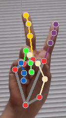

# Computer Camera Control
<small>Using computer vision to command your computer</small>

I hope you enjoy! 😊

## Summary

- [Features](#features)
- [How can I achieve each feature?](#how-can-i-achieve-each-feature)
- [Code description](#code-description)

## Features

- [X] Mouse movement - left hand;
- [X] Click (right, left, double)  - left hand;
- [X] Drag mouse - left hand;
- [X] Increase and decrease volume - right hand; 
- [X] Use keyboard shortcuts (arrows, Esc, open keyboard, and space) - right hand;
- [X] Zoom in and out - both hands;
- [X] Start-stop command.

## How can I achieve each feature?

First run the index.py code. After the camera turns on, to start commanding your computer, raise both your hands with all the fingers up in the with the back of your hands facing the camera. In the console, if "True" appears, you can start commanding the computer.

Start-Stop gesture

* To **move the mouse**, use your left hand with only the index finger raised;

Mouse control gesture

* To **single left click**, keep the left hand index finger raised and raise the left hand middle finger;

Single left click

* To **double left click**, keep the left hand index finger raised and raise both the left hand middle and ring fingers;

Double left click

* To **single right click**, keep the left hand index finger raised and raise the left hand pinky finger;

Single right click

* To **click and drag**, close all the left hand fingers and move the desired object. To un-click, just raise the left hand index finger.

Click and drag, than...

Release the object

* To **change the volume**, keep all the fingers of the right hand up, and i) increase the volume, keep the index and thumb fingers far from each other; ii) decrease the volume, keep the index and thumb fingers close to each other;

Volume up

Volume down

* To **use the keyboards shortcuts** use your right hand, keeping all the fingers down and:
  * Left arrow: raise the thumb;

  
  
Left arrow

  * Right arrow: raise the pinky;

  
  
Right arrow

  * Up arrow: raise the index;

  
  
Up arrow

  * Down arrow: raise both index and middle fingers;

  
  
Down arrow

  * Esc: raise both thumb and index fingers;

  
  
Esc

  * Space: raise both thumb and pinky fingers;

  
  
Space

  * Open virtual keyboard: raise both index and pinky fingers;

  
  
Virtual keyboard

* To **zoom in** use both hands with only the thumb fingers raised;

Zoom in

* To **zoom out** use both hands with only index fingers raised;

Zoom out

To stop commanding the computer, again raise both your hands with all the fingers up in the with the back of your hands facing the camera. In the console, if "False" appears, you stopped commanding the computer.

Start-Stop gesture

## Code description

In the index.py file is the main code, with several comments indicating the code purposes. It uses classes created in the resources.py file, which is also very well commented indicating the code purposes.

This code uses the well-trained and implemented model MediaPipe from Google.